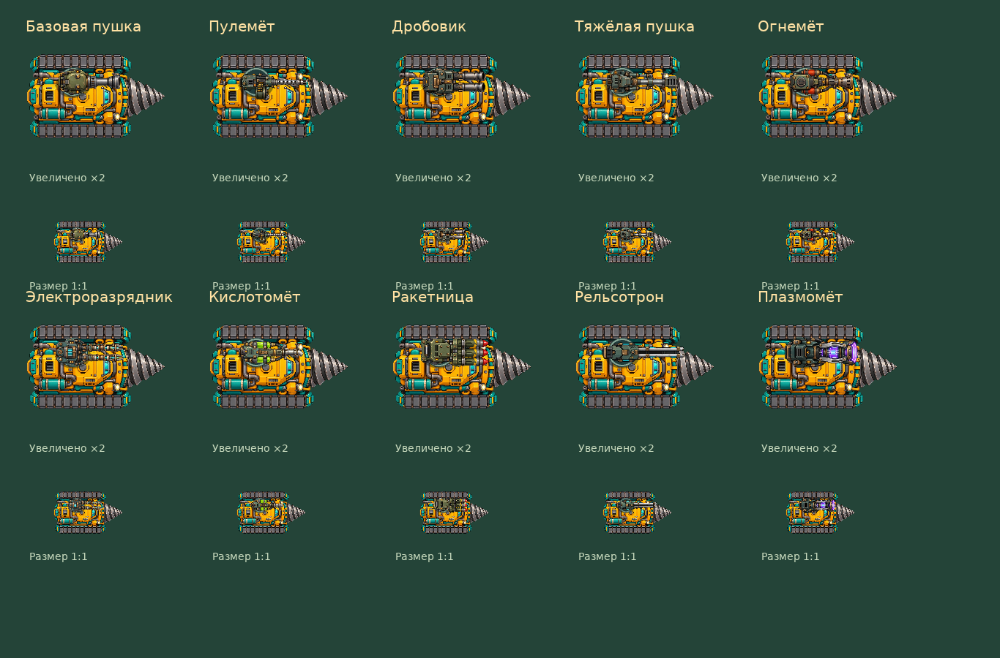

# Оружие на буре — 09.10.2026

Все десять пушек получили прозрачные спрайты строго сверху, стволом вправо. Те же изображения используются в оружейной (миниатюры и крупный просмотр), каталоге рецептов и на самом буре. Вместо прежних примитивов Phaser загружает текстуры; прежняя геометрия служит резервом при отсутствии текстуры. Рецепты, цены и боевые параметры не меняются.

## Размер и читаемость

Каждый WebP имеет размер 512×256. Для упаковки спрайта границы определяются по содержимому с альфой выше 32, с запасом 8 исходных пикселей; внутри границ исходный альфа-канал сохраняется. Это исключает почти прозрачные пиксели в далёких пустых полях из расчёта масштаба. Использованы крупные болты, редкие широкие прорези, контрастные металлические грани и характерные детали — барабан, баки, катушки, направляющие. Фактура при уменьшении неизбежно теряется, поэтому различимость держится на форме и крупных цветных акцентах.

Ширина на буре: базовая пушка 46, пулемёт 50, дробовик 46, тяжёлая пушка 52, огнемёт 48, электроразрядник 50, кислотомёт 48, ракетница 50, рельсотрон 60, плазмомёт 54 игровых пикселя. Высота — половина ширины. Общая точка крепления находится на крыше в (-5,-9), Точки origin подобраны по корпусу отдельно для каждого оружия; у пулемёта originY=.38 из-за бокового барабана. Вспышка учитывает смещение изогнутого сопла кислотомёта. Корпус пушки вращается к цели независимо от бура. При выстреле спрайт откатывается на 2 пикселя и возвращается за 180 мс; вспышка длится 75 мс, её цвет зависит от вида оружия. Улучшение выделяет кольцо крепления золотым цветом, не окрашивая сам спрайт.

## Проверки

Автоматические тесты, сборка и проверка реального Phaser: переключение всех 10 текстур, размеры, отдача и её завершение, исчезновение вспышки. Визуальное сравнение на буре в масштабе 1:1 и ×2, загрузка 10 миниатюр в оружейной и мобильная вёрстка.

## Ассеты и промпты

Режим: встроенный Imagegen; отдельная генерация каждого изображения с прозрачным фоном.

### Базовая пушка

`public/assets/game/drill-weapon-basic.webp`

Use case: stylized-concept. Asset type: production top-down roof-mounted weapon sprite for a small drilling vehicle in cartoon post-apocalyptic game БУР. Weapon: Single short thick cannon barrel with a wide stepped muzzle, one cooling collar and a rounded compact olive housing with two clearly separated brass bolt heads. CRITICAL CAMERA: strict orthographic 90-degree overhead view, looking straight down at the TOP surfaces. NO perspective, NO isometric angle, NO front-facing view. Weapon points EXACTLY horizontally RIGHT, horizontal centerline at 50% image height. Mountable low-profile weapon only: no vehicle, no tower, no concrete foundation, no pedestal, no scenery. Squared composition: full weapon occupies a horizontal band through the middle; transparent space above and below. The compact rear housing is on the LEFT, centered near 30% canvas width; muzzle near 90% canvas width. Entire object fully visible with margins. Small-size legibility is paramount: chunky silhouette, widely separated major parts, large crisp bolt heads, few broad cooling grooves, clear dark outlines, bright edge bevels. Hand-painted cartoon style matching existing game assets: weathered teal/olive steel, warm bronze hardware, clean silver barrel highlights, a few tiny amber indicator lamps. No noisy scratches or dense microtexture. Rich careful details at full resolution that read clearly at 50 pixels total width. Genuinely transparent background. No text, labels, numbers, watermark or decorative frame. No firing or muzzle flash.

### Пулемёт

`public/assets/game/drill-weapon-machinegun.webp`

Use case: stylized-concept. Asset type: production top-down roof-mounted weapon sprite for a small drilling vehicle in cartoon post-apocalyptic game БУР. Weapon: Single narrow long perforated machine-gun barrel with large clearly spaced ventilation holes, a chunky side ammunition drum and a short visible brass cartridge belt beside the compact housing. CRITICAL CAMERA: strict orthographic 90-degree overhead view, looking straight down at the TOP surfaces. NO perspective, NO isometric angle, NO front-facing view. Weapon points EXACTLY horizontally RIGHT, horizontal centerline at 50% image height. Mountable low-profile weapon only: no vehicle, no tower, no concrete foundation, no pedestal, no scenery. Squared composition: full weapon occupies a horizontal band through the middle; transparent space above and below. The compact rear housing is on the LEFT, centered near 30% canvas width; muzzle near 90% canvas width. Entire object fully visible with margins. Small-size legibility is paramount: chunky silhouette, widely separated major parts, large crisp bolt heads, few broad cooling grooves, clear dark outlines, bright edge bevels. Hand-painted cartoon style matching existing game assets: weathered teal/olive steel, warm bronze hardware, clean silver barrel highlights, a few tiny amber indicator lamps. No noisy scratches or dense microtexture. Rich careful details at full resolution that read clearly at 50 pixels total width. Genuinely transparent background. No text, labels, numbers, watermark or decorative frame. No firing or muzzle flash.

### Дробовик

`public/assets/game/drill-weapon-shotgun.webp`

Use case: stylized-concept. Asset type: production top-down roof-mounted weapon sprite for a small drilling vehicle in cartoon post-apocalyptic game БУР. Weapon: Two distinctly separated short wide shotgun barrels side by side, two large dark muzzle openings at the right, compact squared armored breech with bronze latch. CRITICAL CAMERA: strict orthographic 90-degree overhead view, looking straight down at the TOP surfaces. NO perspective, NO isometric angle, NO front-facing view. Weapon points EXACTLY horizontally RIGHT, horizontal centerline at 50% image height. Mountable low-profile weapon only: no vehicle, no tower, no concrete foundation, no pedestal, no scenery. Squared composition: full weapon occupies a horizontal band through the middle; transparent space above and below. The compact rear housing is on the LEFT, centered near 30% canvas width; muzzle near 90% canvas width. Entire object fully visible with margins. Small-size legibility is paramount: chunky silhouette, widely separated major parts, large crisp bolt heads, few broad cooling grooves, clear dark outlines, bright edge bevels. Hand-painted cartoon style matching existing game assets: weathered teal/olive steel, warm bronze hardware, clean silver barrel highlights, a few tiny amber indicator lamps. No noisy scratches or dense microtexture. Rich careful details at full resolution that read clearly at 50 pixels total width. Genuinely transparent background. No text, labels, numbers, watermark or decorative frame. No firing or muzzle flash.

### Тяжёлая пушка

`public/assets/game/drill-weapon-heavy.webp`

Use case: stylized-concept. Asset type: production top-down roof-mounted weapon sprite for a small drilling vehicle in cartoon post-apocalyptic game БУР. Weapon: Very thick single large-bore cannon barrel with massive square muzzle brake, two obvious parallel recoil cylinders along the barrel and broad angular armored breech. CRITICAL CAMERA: strict orthographic 90-degree overhead view, looking straight down at the TOP surfaces. NO perspective, NO isometric angle, NO front-facing view. Weapon points EXACTLY horizontally RIGHT, horizontal centerline at 50% image height. Mountable low-profile weapon only: no vehicle, no tower, no concrete foundation, no pedestal, no scenery. Squared composition: full weapon occupies a horizontal band through the middle; transparent space above and below. The compact rear housing is on the LEFT, centered near 30% canvas width; muzzle near 90% canvas width. Entire object fully visible with margins. Small-size legibility is paramount: chunky silhouette, widely separated major parts, large crisp bolt heads, few broad cooling grooves, clear dark outlines, bright edge bevels. Hand-painted cartoon style matching existing game assets: weathered teal/olive steel, warm bronze hardware, clean silver barrel highlights, a few tiny amber indicator lamps. No noisy scratches or dense microtexture. Rich careful details at full resolution that read clearly at 50 pixels total width. Genuinely transparent background. No text, labels, numbers, watermark or decorative frame. No firing or muzzle flash.

### Огнемёт

`public/assets/game/drill-weapon-flame.webp`

Use case: stylized-concept. Asset type: production top-down roof-mounted weapon sprite for a small drilling vehicle in cartoon post-apocalyptic game БУР. Weapon: Short wide flame nozzle with orange pilot indicator, two small orange-red fuel cylinders mounted along the housing sides, clearly visible thick curved hoses connecting to the nozzle. CRITICAL CAMERA: strict orthographic 90-degree overhead view, looking straight down at the TOP surfaces. NO perspective, NO isometric angle, NO front-facing view. Weapon points EXACTLY horizontally RIGHT, horizontal centerline at 50% image height. Mountable low-profile weapon only: no vehicle, no tower, no concrete foundation, no pedestal, no scenery. Squared composition: full weapon occupies a horizontal band through the middle; transparent space above and below. The compact rear housing is on the LEFT, centered near 30% canvas width; muzzle near 90% canvas width. Entire object fully visible with margins. Small-size legibility is paramount: chunky silhouette, widely separated major parts, large crisp bolt heads, few broad cooling grooves, clear dark outlines, bright edge bevels. Hand-painted cartoon style matching existing game assets: weathered teal/olive steel, warm bronze hardware, clean silver barrel highlights, a few tiny amber indicator lamps. No noisy scratches or dense microtexture. Rich careful details at full resolution that read clearly at 50 pixels total width. Genuinely transparent background. No text, labels, numbers, watermark or decorative frame. No firing or muzzle flash.

### Электроразрядник

`public/assets/game/drill-weapon-electric.webp`

Use case: stylized-concept. Asset type: production top-down roof-mounted weapon sprite for a small drilling vehicle in cartoon post-apocalyptic game БУР. Weapon: Directional electrical discharge cannon, two parallel bronze coil-wrapped prongs pointing right with ceramic insulating bands and small restrained cyan luminous gaps, compact armored capacitor housing. CRITICAL CAMERA: strict orthographic 90-degree overhead view, looking straight down at the TOP surfaces. NO perspective, NO isometric angle, NO front-facing view. Weapon points EXACTLY horizontally RIGHT, horizontal centerline at 50% image height. Mountable low-profile weapon only: no vehicle, no tower, no concrete foundation, no pedestal, no scenery. Squared composition: full weapon occupies a horizontal band through the middle; transparent space above and below. The compact rear housing is on the LEFT, centered near 30% canvas width; muzzle near 90% canvas width. Entire object fully visible with margins. Small-size legibility is paramount: chunky silhouette, widely separated major parts, large crisp bolt heads, few broad cooling grooves, clear dark outlines, bright edge bevels. Hand-painted cartoon style matching existing game assets: weathered teal/olive steel, warm bronze hardware, clean silver barrel highlights, a few tiny amber indicator lamps. No noisy scratches or dense microtexture. Rich careful details at full resolution that read clearly at 50 pixels total width. Genuinely transparent background. No text, labels, numbers, watermark or decorative frame. No firing or muzzle flash.

### Кислотомёт

`public/assets/game/drill-weapon-acid.webp`

Use case: stylized-concept. Asset type: production top-down roof-mounted weapon sprite for a small drilling vehicle in cartoon post-apocalyptic game БУР. Weapon: Short slim curved spray nozzle, twin lime-green fluid reservoirs protected by metal clamps along the housing sides, visible dark fluid hose and corrosion-resistant pale steel muzzle. CRITICAL CAMERA: strict orthographic 90-degree overhead view, looking straight down at the TOP surfaces. NO perspective, NO isometric angle, NO front-facing view. Weapon points EXACTLY horizontally RIGHT, horizontal centerline at 50% image height. Mountable low-profile weapon only: no vehicle, no tower, no concrete foundation, no pedestal, no scenery. Squared composition: full weapon occupies a horizontal band through the middle; transparent space above and below. The compact rear housing is on the LEFT, centered near 30% canvas width; muzzle near 90% canvas width. Entire object fully visible with margins. Small-size legibility is paramount: chunky silhouette, widely separated major parts, large crisp bolt heads, few broad cooling grooves, clear dark outlines, bright edge bevels. Hand-painted cartoon style matching existing game assets: weathered teal/olive steel, warm bronze hardware, clean silver barrel highlights, a few tiny amber indicator lamps. No noisy scratches or dense microtexture. Rich careful details at full resolution that read clearly at 50 pixels total width. Genuinely transparent background. No text, labels, numbers, watermark or decorative frame. No firing or muzzle flash.

### Ракетница

`public/assets/game/drill-weapon-rocket.webp`

Use case: stylized-concept. Asset type: production top-down roof-mounted weapon sprite for a small drilling vehicle in cartoon post-apocalyptic game БУР. Weapon: Compact square rocket-launcher module with four clearly separated launch tubes pointing right in a flat two-by-two block, red-tipped rockets visible at right mouths, angular olive housing and yellow caution trim. CRITICAL CAMERA: strict orthographic 90-degree overhead view, looking straight down at the TOP surfaces. NO perspective, NO isometric angle, NO front-facing view. Weapon points EXACTLY horizontally RIGHT, horizontal centerline at 50% image height. Mountable low-profile weapon only: no vehicle, no tower, no concrete foundation, no pedestal, no scenery. Squared composition: full weapon occupies a horizontal band through the middle; transparent space above and below. The compact rear housing is on the LEFT, centered near 30% canvas width; muzzle near 90% canvas width. Entire object fully visible with margins. Small-size legibility is paramount: chunky silhouette, widely separated major parts, large crisp bolt heads, few broad cooling grooves, clear dark outlines, bright edge bevels. Hand-painted cartoon style matching existing game assets: weathered teal/olive steel, warm bronze hardware, clean silver barrel highlights, a few tiny amber indicator lamps. No noisy scratches or dense microtexture. Rich careful details at full resolution that read clearly at 50 pixels total width. Genuinely transparent background. No text, labels, numbers, watermark or decorative frame. No firing or muzzle flash.

### Рельсотрон

`public/assets/game/drill-weapon-rail.webp`

Use case: stylized-concept. Asset type: production top-down roof-mounted weapon sprite for a small drilling vehicle in cartoon post-apocalyptic game БУР. Weapon: Very long slender railgun with two visibly separated parallel silver focusing rails pointing right, a large open dark channel between them, cyan small capacitor strips, narrow angular breech. CRITICAL CAMERA: strict orthographic 90-degree overhead view, looking straight down at the TOP surfaces. NO perspective, NO isometric angle, NO front-facing view. Weapon points EXACTLY horizontally RIGHT, horizontal centerline at 50% image height. Mountable low-profile weapon only: no vehicle, no tower, no concrete foundation, no pedestal, no scenery. Squared composition: full weapon occupies a horizontal band through the middle; transparent space above and below. The compact rear housing is on the LEFT, centered near 30% canvas width; muzzle near 90% canvas width. Entire object fully visible with margins. Small-size legibility is paramount: chunky silhouette, widely separated major parts, large crisp bolt heads, few broad cooling grooves, clear dark outlines, bright edge bevels. Hand-painted cartoon style matching existing game assets: weathered teal/olive steel, warm bronze hardware, clean silver barrel highlights, a few tiny amber indicator lamps. No noisy scratches or dense microtexture. Rich careful details at full resolution that read clearly at 50 pixels total width. Genuinely transparent background. No text, labels, numbers, watermark or decorative frame. No firing or muzzle flash.

### Плазмомёт

`public/assets/game/drill-weapon-plasma.webp`

Use case: stylized-concept. Asset type: production top-down roof-mounted weapon sprite for a small drilling vehicle in cartoon post-apocalyptic game БУР. Weapon: Short thick plasma emitter with a large luminous violet circular muzzle at right, two curved silver focusing ribs surrounding a bright cyan-purple core, dark teal angular housing. CRITICAL CAMERA: strict orthographic 90-degree overhead view, looking straight down at the TOP surfaces. NO perspective, NO isometric angle, NO front-facing view. Weapon points EXACTLY horizontally RIGHT, horizontal centerline at 50% image height. Mountable low-profile weapon only: no vehicle, no tower, no concrete foundation, no pedestal, no scenery. Squared composition: full weapon occupies a horizontal band through the middle; transparent space above and below. The compact rear housing is on the LEFT, centered near 30% canvas width; muzzle near 90% canvas width. Entire object fully visible with margins. Small-size legibility is paramount: chunky silhouette, widely separated major parts, large crisp bolt heads, few broad cooling grooves, clear dark outlines, bright edge bevels. Hand-painted cartoon style matching existing game assets: weathered teal/olive steel, warm bronze hardware, clean silver barrel highlights, a few tiny amber indicator lamps. No noisy scratches or dense microtexture. Rich careful details at full resolution that read clearly at 50 pixels total width. Genuinely transparent background. No text, labels, numbers, watermark or decorative frame. No firing or muzzle flash.

